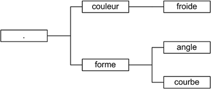

TP Commandes linux : 
--------------------
* allez dans le répertoire "home" (~) 
* créez un dossier "tp_pooc"
* creéz un fichier "texte.txt" dans ce dossier qui contient une phrase (n'importe laquelle)
* Rénomez le fichier texte.txt en texte2.txt
* Vérifiez la modification avec la commande `ls`
* Créez un sous-dossier `sous_dossier`
* Copier le fichier texte2.txt dans `sous_dossier` sous un autre nom (texte3.txt par exemple)
* affichez le contenu du fichier texte3.txt
* Copiez le dossier "sous_dossier" (avec son contenu) dans le répertoire "tp\_pooc" sous le nom "autre\_dossier"
* Assurez vous de l'existence du fichier texte3.txt dans le dossier autre_dossier.
* exportez votre historique de commande dans un fichier historique.txt

-----

* Allez dans votre répertoire personnel.
* Créez un répertoire portant le nom "arbo" .
* Allez dans votre répertoire arbo.
* Créez l’arborescence rep1/rep2/rep3/rep4.
* Listez le contenu du répertoire courant de façon récursive.
* Supprimez le répertoire rep1. Est-ce possible ?
* Supprimez l’arborescence de répertoires rep1/rep2/rep3/rep4, puis vérifiez en listant le répertoire courant de façon récursive.
* Créez maintenant l’arborescence suivante dans votre répertoire courant (~/arbo) sans changer de répertoire :  

* Créez les fichiers ne contenant aucune donnée et dont les noms sont les suivants : rond, triangle, carre, rectangle, vert et bleu.
* Déplacez le fichier rond dans le répertoire courbe, et les fichiers triangle, carre et rectangle dans le répertoire angle.
* Déplacez maintenant les fichiers vert et bleu dans le répertoire froide.
* Allez dans le répertoire couleur et affichez le contenu du répertoire de façon récursive.
* Copiez le répertoire froide sous le nouveau nom : chaude. 
* Allez dans le répertoire chaude et renommez le fichier bleu en rouge et vert en jaune.